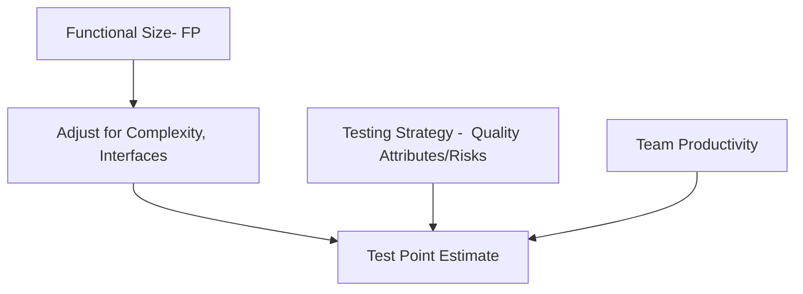
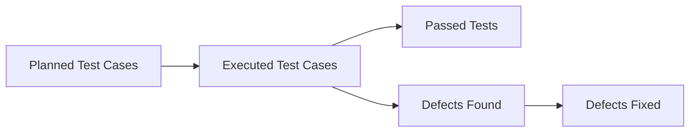

## 1. Test Point Analysis (TPA): Concepts & Process
- Purpose: Objectively estimate effort needed for black-box, system, or acceptance testing (complementing function point analysis in white-box testing).​
- Main Inputs:
    - Size: Based on function points (FPs), adjusted for complexity, number of interfaces, and uniformity.​
    - Strategy: Specifies which quality characteristics (functionality, security, usability, efficiency) and risks are to be tested, and their coverage depth.​
    - Productivity: Skill, experience, and tools used by the testing team.​
Mermaid Diagram: Core Inputs and Flow

## Step-by-Step TPA Process
1. Function Point Counting:
    - Measure the software's user-facing functions (inputs, outputs, files).
2. Complexity Factors:
    - Adjust FP value for function complexity, interfaces, uniformity, user-importance, and usage-intensity.​
    - Example rating systems:
        - User-importance: Low (3), Normal (6), High (12)
        - Usage-intensity: Low (2), Normal (4), High (12)
3. Quality Characteristics: Assign weight for each quality attribute (dynamic/static), e.g., suitability, security, usability, efficiency.​
4. Calculate Test Points:
    - For each function: $$TPf = FPf × Df × Qd (Dynamic)$$
    - Add static test points for attributes like maintainability, flexibility.
5. Total Test Points: $$TP =  ΣTPf (dynamic) + static TP adjustments$$ 
Formula (from source):
$$TP=∑TPf+FP×Qi500TP = \sum TPf + \frac{FP \times Qi}{500}TP=∑TPf+500FP×Qi$$

Where:
- TPf: test points assigned per function
- FP: total function points
- Qi: weight for indirect/static quality characteristics
## 2. Testing Progress Metrics: Monitoring & Reporting

Testing progress metrics help teams monitor, communicate, and manage testing throughout the lifecycle. Key metrics include:

|Progress Metric|Description/Formula|Purpose|
|---|---|---|
|Test Case Execution Rate|Executed / Planned test cases × 100%|Track speed vs plan|
|Test Coverage|(Covered/Total items) × 100%|Reveal thoroughness/gaps|
|Defect Detection %|(Defects found in testing / Total defects by release)×100|Measures effectiveness|
|Defect Density|Defects / Size (LOC, FP, TP)|Signals quality/risk|
|Test Pass Rate|(Passed / Executed tests) × 100%|Assess readiness/stability|
|Open Critical Bugs|Count of uncured high-impact bugs|Release decision trigger|
|Regression Stability|Stable regression runs / Total runs × 100|Change management safety|

## 3. TPA & Progress Metrics: Integration Table

|TPA Output|How It Links to Progress Metrics|
|---|---|
|Total Test Points|Scales with test effort & resource needs|
|Dynamic Test Points|Drives system test coverage and priorities|
|Static Test Points|Ensures static attributes (security, etc) are included|
|Productivity Factors|Affects velocity, cycle time, test execution rate|
|Quality Attribute Weights|Guide coverage – help set targets (coverage, defect density)|
## 4. Advantages of TPA and Progress Metrics
- Objective estimation reduces guesswork for test planning.
- Supports risk-based prioritization for regression, high-impact, and customer-critical functions.
- Enables dynamic adjustment as project scope, resources, and risks change.
- Promotes transparency for stakeholders via dashboard metrics.
## 5. Quick Reference Table: Black-Box Estimation & Progress

|Technique / Metric|Estimation Focus|Tracking/Progress Focus|
|---|---|---|
|Test Point Analysis|Effort, resource allocation|Dynamic coverage, prioritization|
|Test Case Execution Rate|N/A|Measures speed, helps replanning|
|Defect Detection Rate|N/A|Measures test effectiveness|
|Productivity/Skill Factor|Scales effort, cost|Predicts possible outcomes|
