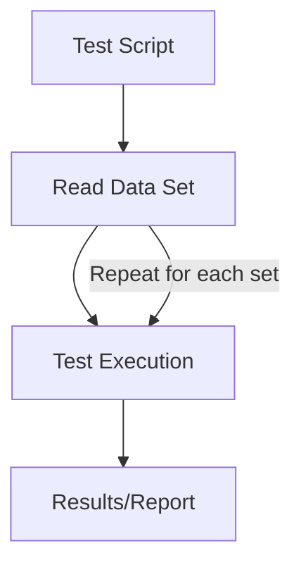
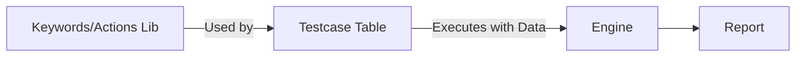

| Aspect      | Data Driven        | Keyword Driven    |
| ----------- | ------------------ | ----------------- |
| Test Logic  | Scripted           | Modular Keywords  |
| Test Data   | External files     | Action tables     |
| Maintenance | Moderate           | High reusability  |
| User Skill  | Some scripting     | Non-programmer OK |
| Flexibility | Broad input combos | Modular scenarios |
## 1. Need for Test Automation
Automation testing is the use of scripts and specialized tools to execute software tests automatically. It is essential in modern QA for several key reasons:
- **Speeds up regression cycles:** Automated tests run rapidly after each code change, supporting fast releases and continuous integration.​
- **Reduces manual effort:** Frees testers from repetitive tasks, enabling them to focus on exploratory or complex scenarios.​
- **Increases accuracy:** Scripts run consistently and precisely, minimizing human error.​
- **Enhances coverage:** Automation enables more test cases across platforms, devices, and business scenarios.​
- **Improves early bug detection:** Problems are found instantly in CI pipelines.​
- **Cost savings & ROI:** Once set up, tests run again and again without new labor costs or delays.
- **Supports DevOps & compliance:** Automated testing is a backbone for CI/CD and for demonstrating regulatory compliance.​

## 2. Guidelines for Automated Testing
- **Choose test cases wisely:** Automate high-value, stable, and repeatable tests (e.g., regression, smoke, critical paths).​
- **Maintain organized test suites:** Group by modules, features, or types for traceability.​
- **Separate test data management:** Use external, maintainable test data sets for consistency.
- **Mimic production-like environments:** Virtualize/configure test setups to match real-world deployments.​
- **Enable parallel execution:** Run tests concurrently across environments to save time.​
- **Handle dependencies and order:** Run independent tests first; sequence dependent tests logically.
- **Update scripts regularly:** Maintain scripts as the application evolves.
- **Monitor and report:** Leverage built-in tool reporting to track results and progress dynamically.
## 3. Categorization of Testing Tools

| Category            | Examples                             | Usage                  |
| ------------------- | ------------------------------------ | ---------------------- |
| Functional          | Selenium, QTP, TestComplete, Ranorex | UI, web, regression    |
| API/Web Services    | Postman, RestAssured, SoapUI         | API, service checks    |
| Performance         | JMeter, LoadRunner, Gatling          | Load, stress, perf     |
| Unit                | JUnit, NUnit, TestNG, xUnit          | Unit/component testing |
| Mobile              | Appium, Espresso, XCUITest           | Mobile platforms       |
| CI/CD Integration   | Jenkins, Azure DevOps, CircleCI      | Orchestration          |
| Data/Keyword Driven | Robot Framework, TestNG, Katalon     | Flexible frameworks    |
| Security            | OWASP ZAP, Burp Suite                | Pen testing            |

## 4. Selection of Testing Tools: Key Criteria
- **Application type/support:** Choose tools compatible with your tech stack (web, mobile, API).
- **Ease of use/programming:** Select according to tester skills (script-less, code-based, interface driven).
- **Integration:** Must work with CI/CD, bug tracking, and reporting tools.
- **Community & support:** Prefer tools with strong documentation and active user support.
- **Scalability & maintenance:** Assess ability to handle thousands of cases and ease of script updates.
- **Cost:** Consider open source vs commercial licenses per organizational need.
- **Reporting & analytics:** Visual dashboards streamline debugging and progress tracking.
## 5. Data Driven Testing
**Definition:** Data driven testing (DDT) means running the same test logic with different sets of input data, typically sourced from external files (CSV, Excel, databases).
- Supports efficient positive/negative case creation and edge-case exploration.
- Reduces script duplication: one test script, many data sets.
**Example Tool:**
- **Selenium + TestNG** allows parameters to be fed from Excel/CSV. Robot Framework has built-in keyword/data separation.
**DDT Flow Diagram (Mermaid):**

## 6. Keyword Driven Testing
**Definition:** Keyword driven frameworks separate test logic (keywords/actions) from test data. Testers define actions (e.g., Login, ClickButton) and combine them with parameters in spreadsheet-like files.
- Empowers non-programmer testers to design cases by combining keywords and data.
- Supports reusable, modular steps.
**Example Tool:**
**Robot Framework** and **Katalon Studio** let you define custom keywords, map them in tables/files, and run combinations for many test scenarios.

**Keyword Driven Framework Diagram (Mermaid):**

