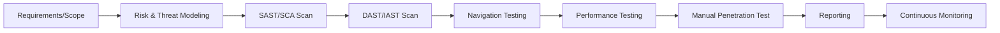

## 1. **Main Challenges in Testing Web-Based Systems**

| Challenge                 | Details                                                                 |
| ------------------------- | ----------------------------------------------------------------------- |
| Diverse User Environments | Browser, OS, device variations; responsive layout, compatibility checks |
| Frequent Updates          | Short release cycles; risk of regression                                |
| Integration Issues        | API, third-party services, payment gateways                             |
| Security Threats          | Attacks (XSS, CSRF, SQLi), sensitive data exposure                      |
| Navigation Complexity     | Multiple workflows and use cases                                        |
| Performance Demands       | High traffic, variable load, global users                               |
## 2. **Security Testing for Web Systems**
_Security is a priority; vulnerabilities are often targeted by attackers. Specialized methodologies and tools are used._
#### Methodologies
- **OWASP Top 10**: Reference list for major vulnerabilities (XSS, SQL Injection, CSRF, etc.)
- **SAST (Static App Security Testing)**: Analyzes source code for flaws (e.g., Veracode, Bandit)
- **DAST (Dynamic App Security Testing)**: Scans running apps for vulnerabilities (e.g., OWASP ZAP, Burp Suite)
- **SCA (Software Composition Analysis)**: Checks dependencies for known weaknesses (e.g., Black Duck)
- **IAST (Interactive)**: Combines SAST and DAST during runtime for deeper insights
- **Manual Penetration Testing**: Ethical hackers find logic flaws missed by tools
#### Security Testing Steps
1. **Scope and Asset Discovery**: List all web apps, pages, APIs in test scope
2. **Threat Modeling & Risk Assessment**: Identify critical assets, likely threats, risk levels
3. **SAST & SCA**: Scan source code and dependencies before deployment
4. **DAST & IAST**: Scan live environments (staging/production) for runtime issues
5. **Pen Testing & Reporting**: Manual exploitation, findings documentation
6. **Continuous Monitoring**: Ongoing scans and alerting for new vulnerabilities
#### Security Testing Tools Table

|Tool|Type|Focus|
|---|---|---|
|OWASP ZAP|DAST|Web app vulnerabilities (SQLi, XSS, etc.)|
|Burp Suite|DAST+|Traffic interception, scanning, penetration tests|
|Bandit|SAST|Source code analysis for security flaws|
|W3af|DAST|Automated vulnerability scanning|
|Veracode|SAST|Code scan, compliance checks|
|Black Duck|SCA|Dependency vulnerability checks|
## 3. Navigation Testing
- Verifies that all menus, links, buttons, and workflows function as intended under normal and edge-case scenarios.
- Uses automated tools (e.g., Selenium, Cypress) and manual exploratory techniques.
- **Test cases include:**
    - Broken links and redirects
    - Consistent menu behavior
    - Breadcrumbs and back-button logic
    - Responsive navigation (desktop/mobile)
## 4. Performance Testing
Assesses responsiveness, speed, scalability, and stability under load. 
#### Performance Testing Dimensions:

| Test Type        | What It Measures                         | Tool Example    |
| ---------------- | ---------------------------------------- | --------------- |
| Load Testing     | Behavior under expected concurrent users | JMeter, Gatling |
| Stress Testing   | Stability under extreme load             | LoadRunner      |
| Scalability      | System response as capacity increases    | BlazeMeter      |
| Endurance (Soak) | Stability over a long time               | JMeter          |
| Spike Testing    | Sudden traffic burst handling            | k6, JMeter      |
 **Metrics to monitor:** page load time, time to first byte, server response time, error rates, resource consumption (CPU, RAM, DB IO) 

---

## 5. Visual: End-to-End Testing Workflow 

