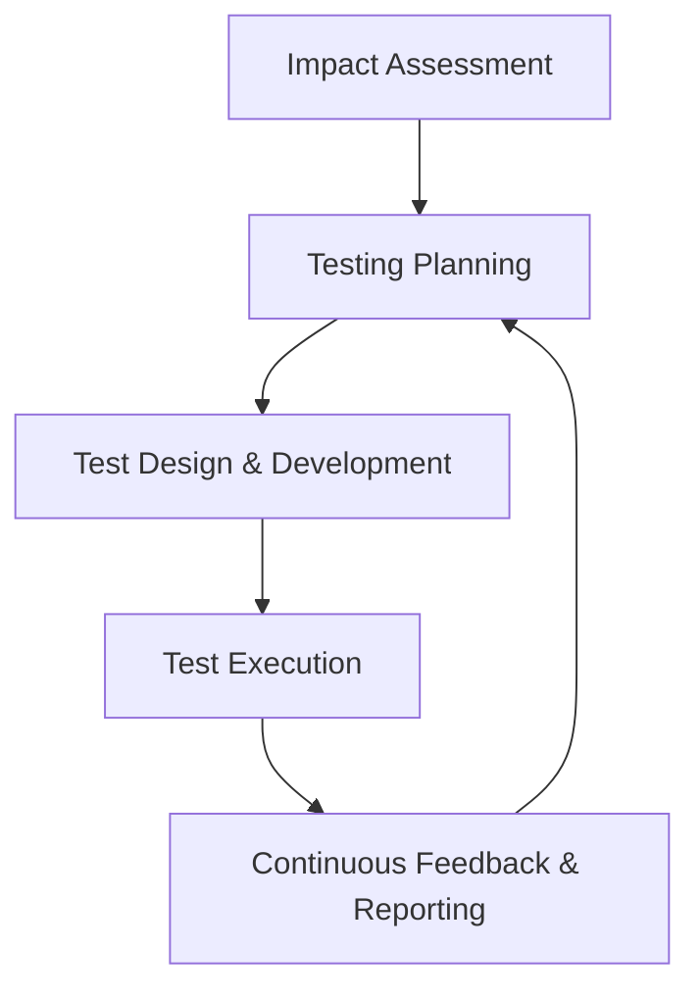
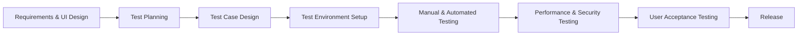

## 1. Testing Agile Based Software
#### Key Features of Agile Testing​
- **Iterative & Incremental:** Testing occurs continuously throughout development.
- **Collaboration:** Developers, testers, and stakeholders work closely, sharing feedback often.
- **Early Defect Detection:** Tests are designed/executed alongside development.
- **Automation Focus:** Regression and repetitive tests are automated for speed and reliability.
- **Flexibility:** Test plans and cases evolve as requirements change.
- **User-Centric:** Testing focuses on user stories, behavior, and acceptance criteria.
#### Common Agile Testing Types

| Testing Type        | Purpose                                   | Implementation                              |
| ------------------- | ----------------------------------------- | ------------------------------------------- |
| Unit Testing        | Verify individual components              | Test-driven development (TDD)               |
| Integration Testing | Confirm interaction between modules       | Integration tests after merges              |
| Functional Testing  | Ensure features meet requirements         | Automated/manual tests against user stories |
| Regression Testing  | Verify no defects introduced from changes | Automated test suites run on each build     |
| Acceptance Testing  | Validate system meets user needs          | Collaborative user acceptance testing       |
| Exploratory Testing | Discover unknown defects creatively       | Ad-hoc/manual test sessions                 |
| Performance Testing | Check responsiveness under load           | Load and stress testing                     |

## Agile Testing Process Lifecycle​

**Key Practices:** Frequent sprint-level planning, continuous integration of tests, early automation, and exploratory testing to complement scripted testing.
## 2. Mobile Application Testing

Mobile testing addresses unique challenges inherent in mobile platforms, devices, networks, and usage contexts.

#### Challenges in Mobile Testing
- **Device Diversity:** Different OS (Android, iOS), versions, screen sizes, hardware capabilities.
- **Network Variability:** Switching between Wi-Fi, 4G/5G, poor connectivity.
- **Resource Constraints:** Battery limits, CPU, memory.
- **Installation/Updates:** Handling app installations, updates,
- **Multi-touch & Sensors:** Testing gestures, GPS, accelerometers, camera.
- **Security & Privacy:** Access controls, data leaks.
#### Types of Mobile Testing

| Testing Type          | Description                                                  |
| --------------------- | ------------------------------------------------------------ |
| Compatibility Testing | Check app behavior across devices, OS versions, resolutions  |
| Functional Testing    | Verify app features according to requirements                |
| Performance Testing   | Assess battery usage, memory, response time                  |
| Network Testing       | Simulate different network conditions                        |
| Security Testing      | Validate data protection, access shield                      |
| Usability Testing     | Evaluate user experience on small screens/varied input modes |
| Interrupt Testing     | Reactivity to calls, SMS, notifications                      |
#### Mobile Testing Tools Examples
- **Appium:** Open-source automation (cross-platform)
- **Espresso (Android):** UI testing framework
- **XCUITest (iOS):** Native testing framework
- **BrowserStack:** Device cloud testing
- **TestFairy:** Beta testing, real user metrics

#### Mobile Testing Workflow (Mermaid Diagram)

