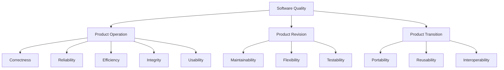

# Software Quality: Concepts, Views, and Metrics

Software quality ensures that software products consistently meet stakeholder needs, deliver reliable performance, and can be efficiently maintained or adapted over time. Quality management in software focuses on preventing defects, measuring key attributes, and guiding continuous improvement.

---
## Five Views of Software Quality
Software quality can be analyzed through different perspectives, each highlighting criteria relevant to various stakeholders.

| **View**           | **Description**                                                                    |
| ------------------ | ---------------------------------------------------------------------------------- |
| **Transcendental** | Quality as something recognizable but hard to define concretely.                   |
| **Product**        | Quality is measured by inherent product attributes (e.g., performance, security).  |
| **User**           | Quality is determined by how well software meets user needs and expectations.      |
| **Manufacturing**  | Quality is defined as conformance to process standards/specs during development.   |
| **Value**          | Quality is judged by the return on investment and value delivered to stakeholders. |

---
## McCall’s Quality Factors and Criteria

McCall’s Quality Model (1977) is a classic framework that organizes software quality into **three categories** and **11 quality factors**, bridging user and developer perspectives with measurable criteria.​

## A. Product Operation

_Focus: How well software runs in day-to-day use._

| Factor          | Description                                                                  |
| --------------- | ---------------------------------------------------------------------------- |
| **Correctness** | Software meets specified requirements and fulfills user mission objectives.  |
| **Reliability** | Performs functions without failure, provides consistent results over time.   |
| **Efficiency**  | Uses minimal resources (CPU, memory, bandwidth); runs fast and economically. |
| **Integrity**   | Guards against unauthorized access or data breaches.                         |
| **Usability**   | Easy to learn, operate, understand; supports user productivity.              |

## B. Product Revision

_Focus: How easily software can be changed, maintained, and tested._

| Factor              | Description                                           |
| ------------------- | ----------------------------------------------------- |
| **Maintainability** | How easily errors can be detected and corrected.      |
| **Flexibility**     | Ease of adapting software for new functions or needs. |
| **Testability**     | Ease of verifying software through testing.           |

## C. Product Transition

_Focus: How well software handles changes in environment and integration needs._

|Factor|Description|
|---|---|
|**Portability**|Ease of moving software to new platforms or environments.|
|**Reusability**|Use of software components in other systems/applications.|
|**Interoperability**|Ability to interact with other systems/external applications.|

## Quality Criteria (Sub-Attributes)

Each factor above is supported by measurable criteria (e.g., modularity, auditability, accuracy, communicativeness, traceability, operability, etc.). For example, usability involves operability, training, communicativeness, and input/output rate.​

---
## Software Quality Metrics

Metrics transform quality objectives into quantitative measurements to track, compare, and improve quality.

|**Metric**|**Description**|
|---|---|
|**Defect Density**|Number of defects per KLOC/function point.|
|**Reliability Metric**|Mean Time Between Failures (MTBF), failure rate.|
|**Efficiency Metric**|Response time, resource utilization.|
|**Maintainability**|Mean Time To Repair (MTTR), change effort, defect fix rate.|
|**Testability**|Code/test coverage, number of test cases per module.|
|**Usability Metric**|Task completion rate, error rate for users, user surveys.|
|**Portability Metric**|Effort/resources required to migrate to another platform.|
|**Reusability Metric**|Number of components reused in other projects.|
|**Interoperability**|Number of successful integrations/interfaces.|
## Example: Defect Density Calculation
` Defect Density = Number of Defects / Size of Software (KLOC or FP) `

---

## Summary Table: McCall's Factors & Example Metrics

| **Category**       | **Factor**       | **Example Metric**            |
| ------------------ | ---------------- | ----------------------------- |
| Product Operation  | Correctness      | Defects per requirements      |
| Product Operation  | Reliability      | MTBF, failure rate            |
| Product Operation  | Efficiency       | CPU/memory/response time      |
| Product Operation  | Integrity        | Security incidents            |
| Product Operation  | Usability        | User error rate/survey score  |
| Product Revision   | Maintainability  | Effort to fix/modify code     |
| Product Revision   | Flexibility      | Effort to add/change features |
| Product Revision   | Testability      | Coverage, test case count     |
| Product Transition | Portability      | Migration/installation effort |
| Product Transition | Reusability      | Components reused             |
| Product Transition | Interoperability | Successful integrations/tests |
