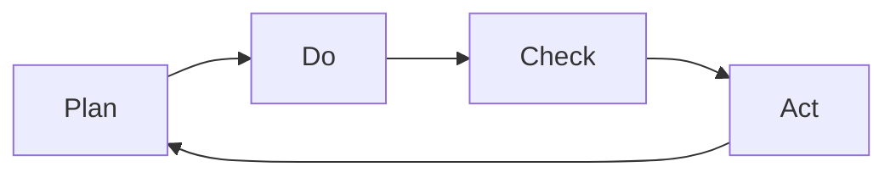
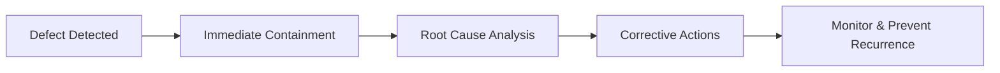

## 1. PDCA Cycle: Foundation of Quality Management
**PDCA** stands for **Plan–Do–Check–Act**: an iterative, cyclic process improvement model widely used for quality management, including in software projects.​

| Step  | Description                                                                                 |
| ----- | ------------------------------------------------------------------------------------------- |
| Plan  | Identify the problem, analyze requirements, set clear objectives, and design a quality plan |
| Do    | Implement the plan, execute processes, and collect data/evidence                            |
| Check | Analyze data/results, measure effectiveness, and compare to objectives                      |
| Act   | Standardize and adopt successful changes, address gaps, and begin a new PDCA loop           |

**Diagram: PDCA Cycle**

**Continuous improvement:** Each iteration solves problems, refines processes, and pushes for higher quality. ​
## 2. Software Quality Plan, Assurance, Control & Methods
**A. Quality Planning**
- Define measurable quality objectives based on requirements and standards
- Develop procedures, tool selection, resource plans, risk analysis
- Output: Quality Plan document (who, what, when, how for quality)

**B. Quality Assurance (QA)**
- Proactive activities to provide confidence software will meet quality goals
- Ex: Audits, process improvement, checklist reviews, training, standards enforcement
- Focus: _Prevention_ (not just detection)

**C. Quality Control (QC)**
- Reactive activities inspecting deliverables for defects and variances
- Ex: Testing, peer reviews, code inspections, defect logging
- Focus: _Detection and correction of issues before release_

|Aspect|QA (Assurance)|QC (Control)|
|---|---|---|
|Focus|Process, prevention|Product, detection|
|Timing|Throughout SDLC|Post-development/implementation|
|Methods|Audits, training, standardization|Inspections, testing, reviews|
## 3. Quality Cost & Benefits
#### Categories of Quality Costs

| Type             | Examples                                        |
| ---------------- | ----------------------------------------------- |
| Prevention costs | Training, process improvement, standards, tools |
| Appraisal costs  | Testing, inspections, quality audits            |
| Internal failure | Defects found before release, rework, retesting |
| External failure | Defects found after release, support, patching  |
#### Total Quality Cost:  $$ CTotal=CPrevention+CAppraisal+CInternal failure+CExternalfailureC_{Total} = C_{Prevention} + C_{Appraisal} + C_{Internal failure} + C_{External failure}CTotal=CPrevention+CAppraisal+CInternal failure+CExternalfailure $$
#### Benefits of Quality Management
- Reduces long-term costs by eliminating expensive failures post-deployment
- Increases user satisfaction and reduces support burden
- Enables timely delivery and builds brand/reputation
- Supports compliance and audit requirements

## 4. Defect Prevention & Root Cause Analysis (RCA)
#### Defect Prevention
- Embed quality by design: code standards, peer reviews, static analysis, early testing
- Shift-left practices: detect and address defects earlier (cheaper fix)
- Use checklists, pair programming, automation to minimize injection
#### Root Cause Analysis (RCA) Cycle
1. **Identify defect:** Log, classify, and prioritize
2. **Containment:** Stop defect propagation (hotfix, patch)
3. **Analyze root cause:** Techniques: 5 Whys, Fishbone (Ishikawa) diagrams
4. **Implement corrective action:** Address root causes (not symptoms)
5. **Monitor outcomes:** Track recurrences, update process if needed
**Diagram: RCA Flow**

## 5. Integrated Quality Management Loop

Effective quality management in software testing blends continuous PDCA cycles, rich planning, preventive QA, rigorous QC, cost/benefit tracking, and learning from failures through RCA. This approach delivers predictability, cost-effectiveness, and sustainable improvement.

