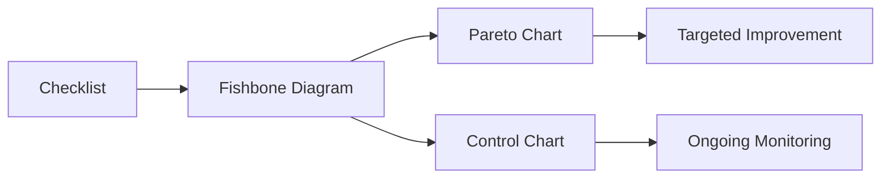
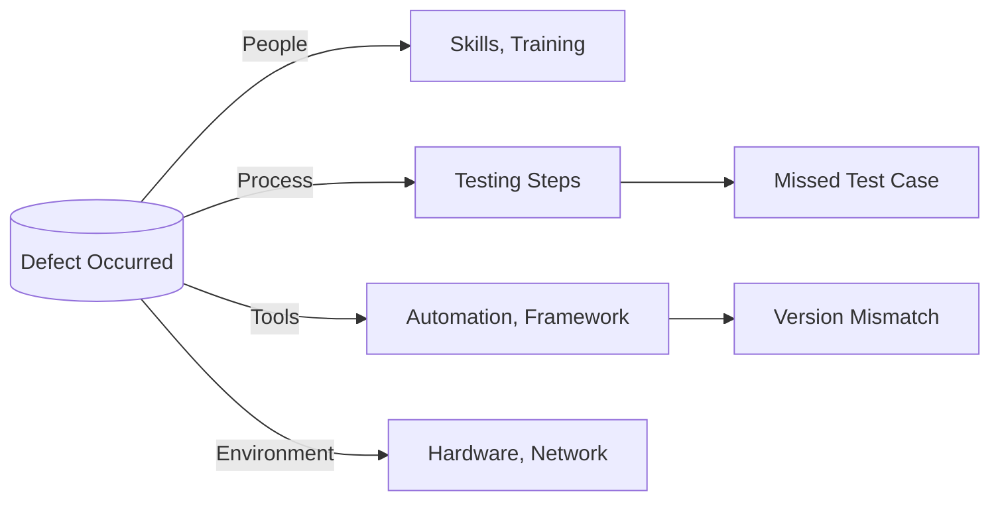
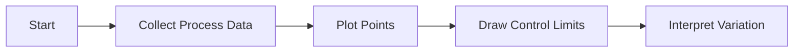
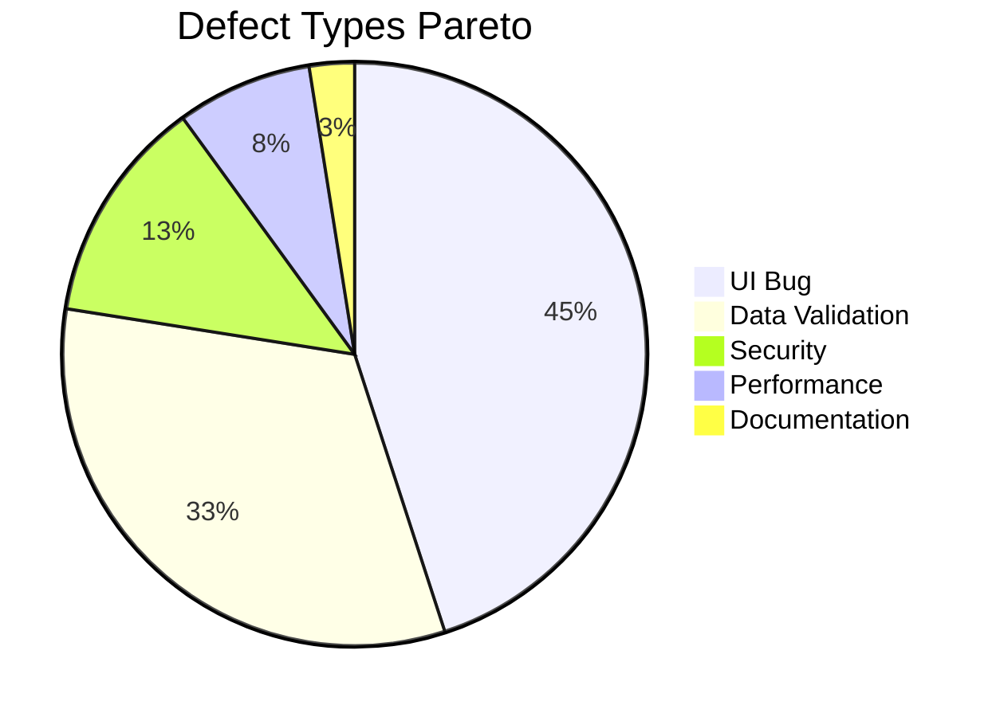

## 1. Ishikawa (Fishbone) Diagram
- **Purpose:** Identify and visualize possible causes of a problem, categorize them, and analyze root causes.​
- **Structure:** Shaped like a fish skeleton; the "head" is the problem statement, "bones" branch to core cause categories.
- **Usage Steps:**
    1. **Define the Problem** (the effect/issue to analyze)
    2. **Identify Main Categories** (e.g., 6Ms for manufacturing, or People, Process, Tools, Environment for IT)
    3. **Brainstorm Possible Causes** (list under each branch)
    4. **Drill Down** (ask "Why?" repeatedly—see 5 Whys technique)
    5. **Analyze & Prioritize** (vote, data analysis, combine with Pareto chart)
- **Benefits:**
    - Systematic root cause analysis in a visual, collaborative format
    - Supports brainstorming and group problem-solving
    - Reveals hidden relationships and bottlenecks

---
## 2. Checklists

- **Purpose:** Ensure consistency and completeness in QA activities, reviews, and audits.
- **Usage:**
    - Pre-release checks (test coverage, documentation, code review)
    - Process audits (adherence to standards)
    - Defect prevention (root causes, frequencies)
- **Tips:**
    - Keep them updated as processes evolve
    - Use digital tools for tracking and reporting (Excel, issue trackers)

**Example Table: Checklist for Software Release**

| Task                | Completed? |
| ------------------- | ---------- |
| Code reviewed       | Yes/No     |
| Unit tests passed   | Yes/No     |
| Security scan done  | Yes/No     |
| Performance tested  | Yes/No     |
| Documentation ready | Yes/No     |

---
## 3. Control Charts
- **Purpose:** Monitor process stability and detect deviations over time.
- **Structure:** Line plots of process data (defects per release, time to fix bugs) with upper and lower control limits.
- **Usage:**
    - Identify periods or events when the process leaves "control"
    - Support decisions: Is process variation random or indicative of a systemic issue?
- **Benefits:**
    - Early warning for process drift or instability
    - Quantitative visualization supports objective decisions

---
## 4. Pareto Chart
- **Purpose:** Prioritize causes of defects/problems by frequency or impact (focus on the "vital few").
- **Structure:** Bar graph sorted in descending order, often with a cumulative line.
- **Usage:**
    - Analyze which defect types or processes cause the most issues
    - Target remediation to top problems for maximum impact​
- **Benefits:**
    - Visual prioritization supports focused improvement
    - Often used in conjunction with Fishbone and RCA to target high-impact root causes
**Example Table: Pareto Analysis of Defect Types**

|Defect Type|Frequency|
|---|---|
|UI Bug|18|
|Data Validation|13|
|Security|5|
|Performance|3|
|Documentation|1|

