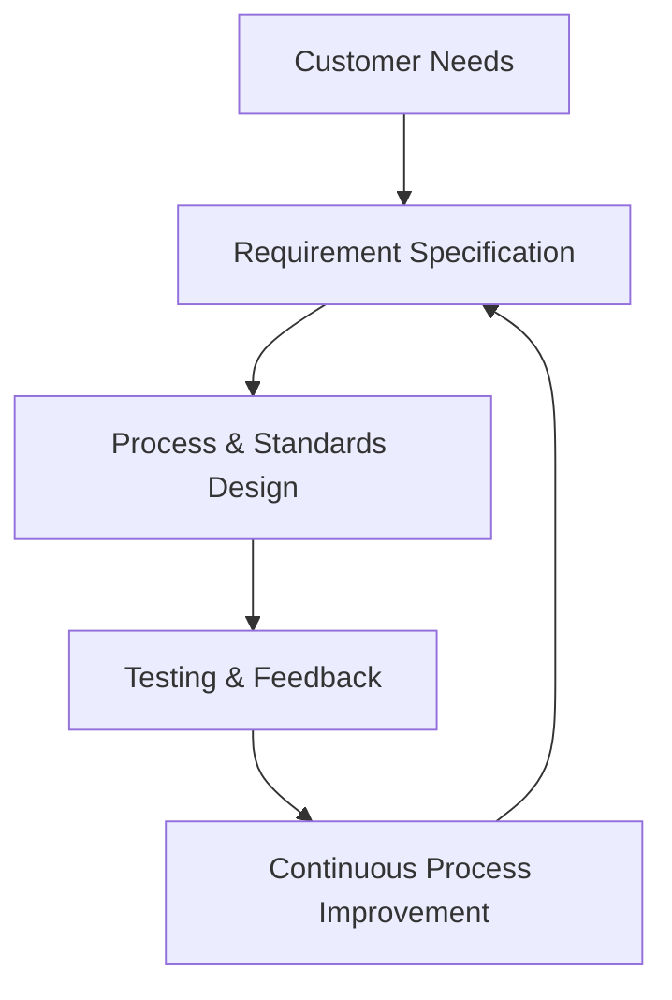
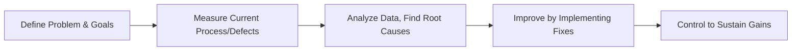
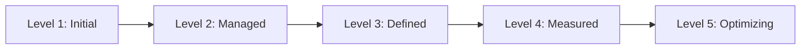

## 1. Software Quality Assurance (SQA) Models
## Key SQA Models and Standards

| Model/Standard                        | Description & Focus                                                                                                                                                                                                |
| ------------------------------------- | ------------------------------------------------------------------------------------------------------------------------------------------------------------------------------------------------------------------ |
| **ISO/IEC 25010**                     | International standard for software product quality—nine key characteristics (functional suitability, performance, compatibility, usability, reliability, security, maintainability, portability, supportability). |
| **McCall, Boehm, FURPS, Dromey**      | Early models breaking down quality into operational (function, reliability, usability) and revision (maintainability) concerns.                                                                                    |
| **CMMI/TMMi**                         | Capability/maturity models for process and testing maturity​.                                                                                                                                                      |
| **TQM (Total Quality Management)**    | Organization-wide approach prioritizing continuous quality improvement​.                                                                                                                                           |
| **Six Sigma**                         | Data-driven methodology for reducing defects to near zero.                                                                                                                                                         |
| **SPC (Statistical Process Control)** | Uses statistical analysis to monitor and improve process stability.                                                                                                                                                |

**Modern SQA:** Now often blends automation, continuous integration, and risk-based, metric-driven frameworks for faster, more reliable releases.

---
## 2. Software Total Quality Management (TQM)

- **Definition:** TQM is a holistic, organization-wide culture and process where all employees participate in continually improving products, services, and processes.
- **Key Principles:**
    - Customer focus
    - Continuous improvement (PDCA cycles)
    - Employee involvement
    - Evidence-based decision making
    - Process-centric approach
    - Quality built into every phase
- **TQM in Software:** Integrate QA from requirements through deployment (shift-left), use cross-functional teams, and align with models like ISO 9000 and CMMI.

---
## 3. Six Sigma in Software QA
- **Definition:** Six Sigma is a data-driven, structured methodology to minimize defects by controlling variation and improving processes.
- **Objective:** Achieve near-zero defects—max of 3.4 defects per million opportunities.
- **Key Methods:**
    - DMAIC: **Define, Measure, Analyze, Improve, Control** (for existing processes)
    - DMADV: **Define, Measure, Analyze, Design, Verify** (for new processes)
- **Six Sigma Tools:** Statistical analysis, control charts, root cause analysis (Fishbone, Pareto), process mapping.
- **In QA:** Applied to reduce defect rates, testing errors, and process inefficiencies.

**Six Sigma DMAIC Cycle (Software Focus):**

---
## 4. Test Maturity Model (TMM/TMMi)

- **Purpose:** Provides a structured model for improving and assessing the maturity of testing processes—complementary to CMM/CMMI but focused on QA/testing.​
- **Levels:** Progression from ad-hoc/chaotic to optimized, proactive QA practices.
#### TMMi Maturity Levels (slight variation in classic TMM/TMMi terminology):​

| Level        | Description                                       | Key Practices/Process Area                      |
| ------------ | ------------------------------------------------- | ----------------------------------------------- |
| 1. Initial   | Unstructured, ad-hoc, chaotic testing             | No formal process                               |
| 2. Managed   | Basic test planning, requirements tracking        | Test policy, management, traceability           |
| 3. Defined   | Organization-wide test process standardization    | Review, metrics, integration with dev process   |
| 4. Measured  | Advanced metrics, review, fault/defect prevention | Peer review, key measurement, proactive improv. |
| 5. Optimized | Continuous process optimization, innovation       | Knowledge management, defect prevention focus   |

- **Use:** Organizations assess their current maturity, identify weak areas, and develop improvement roadmaps​.